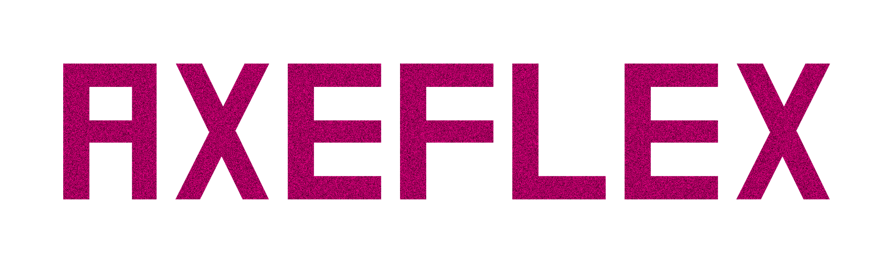
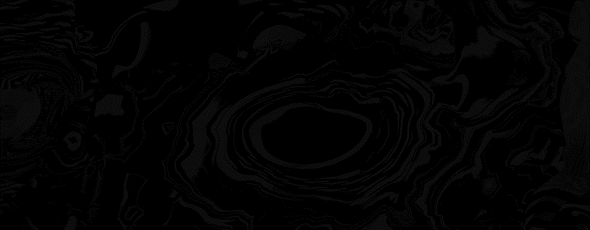

> • 自己破壊 • 自己破壊 • 自己破壊 • 自己破壊 • 自己破壊 • 自己破壊 • 自己破壊 • 自己破壊 • 自己破壊 • 自己破壊 • 自己破壊 •

  

  <pre>
💼 :: This account has nothing to do with reality, all actions on this page are an illusion.
💻 :: btw I use Linux 
📖 :: Fullstack developer in Python / C / C++ / Golang / JS 
  </pre>
  
  
  

